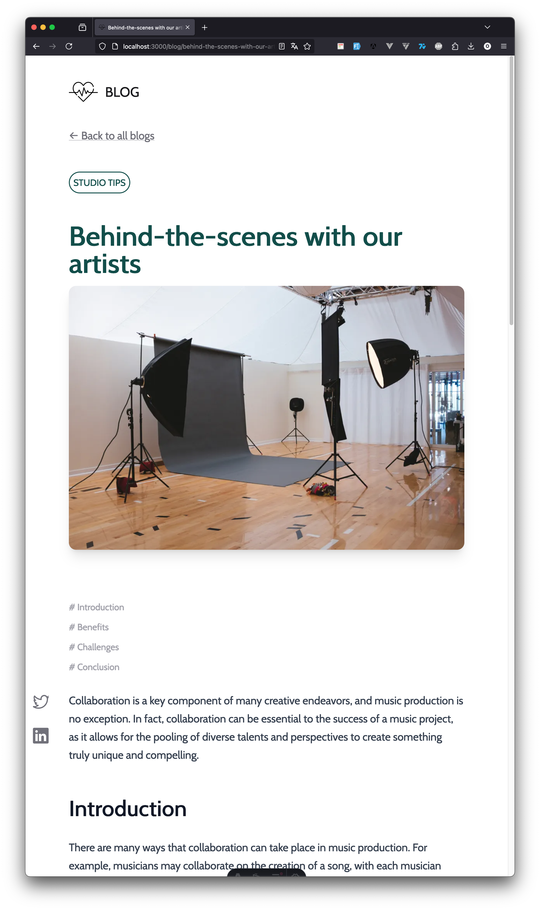

# Astro Course Demo

This repository contains the source code from a tutorial project designed to teach you how to use Astro. Course available at [https://learn.jamesqquick.com/](https://learn.jamesqquick.com/).

## About the Project

This tutorial project is divided into several sections that cover different aspects of developing with Astro, including:

- **Introduction to Astro**: Basics and core concepts.
- **Project Structure**: Organizing files and folders in an Astro project.
- **Astro Components**: Creating and using components.
- **Styling with Tailwind CSS**: Integrating and using Tailwind CSS in Astro.
- **Routing and Navigation**: Setting up routes and navigation in an Astro application.
- **Deployment**: How to deploy a website built with Astro.

## Getting Started

To get started with the project, you can use the following commands:

### Commands

| Command                   | Action                                           |
| :------------------------ | :----------------------------------------------- |
| `npm install`             | Installs dependencies                            |
| `npm run dev`             | Starts local dev server at `localhost:3000`      |
| `npm run build`           | Builds your production site to `./dist/`         |
| `npm run preview`         | Previews your build locally, before deploying    |
| `npm run astro ...`       | Run CLI commands like `astro add`, `astro check` |
| `npm run astro -- --help` | Get help using the Astro CLI                     |

## Deployment

The site can be deployed using services like [Netlify](https://www.netlify.com/) or [Vercel](https://vercel.com/). Ensure that your production build is optimized and that the necessary environment variables are set up in your deployment provider's dashboard.

## Screenshots

